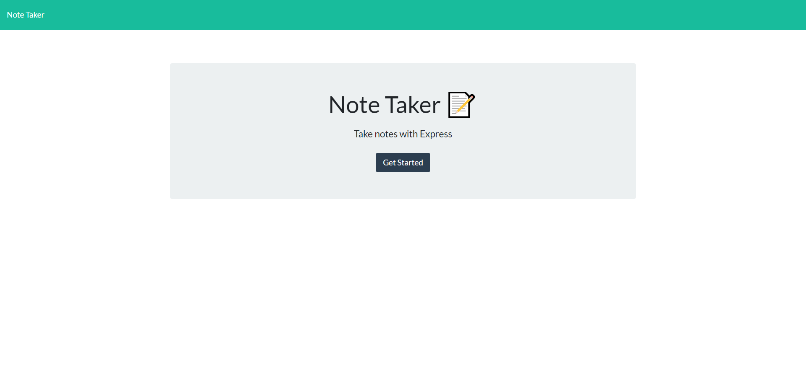
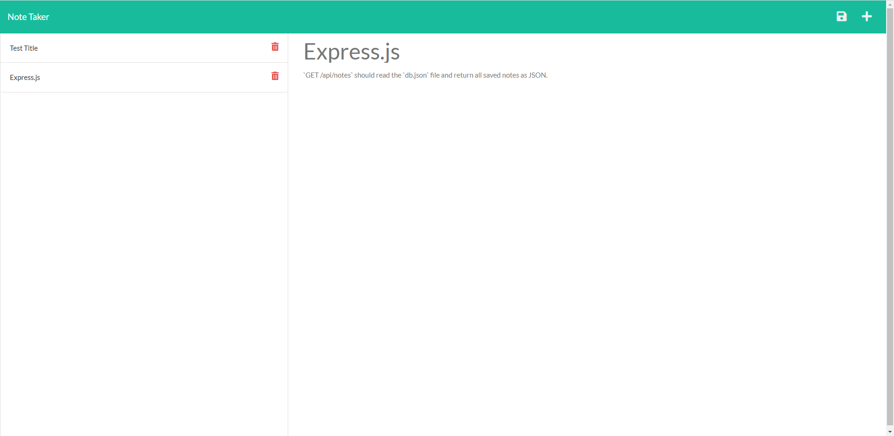

# Note Taker

## Description
Note Taker application that can be used to write and save notes by using [Express.js](https://expressjs.com/en/5x/api.html) This connects the backend to the frontend which saves and retrieves note data from a JSON file. [Link to deployed Heroku app](https://pure-woodland-91033.herokuapp.com/)

## Table of Contents
* [Installation](#installation)
* [Usage](#usage)
* [License](#license)
* [Contributing](#contributing)
* [Tests](#tests)
* [Questions](#questions)

## Installation:
Node JS, and dependencies

## Usage:

Add a note:
1. Click the '➕' button to add a new note.
2. Enter the note title in the title input field.
3. Enter the note content in the content input field.
4. Click the '💾' button in the top right corner.

## License:
This Project is licensed under: [Apache 2.0](./LICENSE)

## Contributing:
Only Me(Keeezy)

## Tests:

## Questions:
If there are questions you can reach me via github/email. Listed below
- https://github.com/keeezy
- lazarokev@gmail.com
